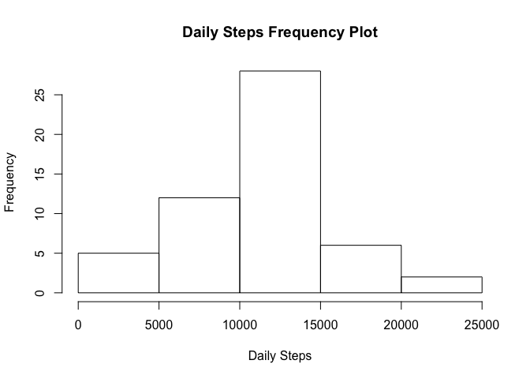
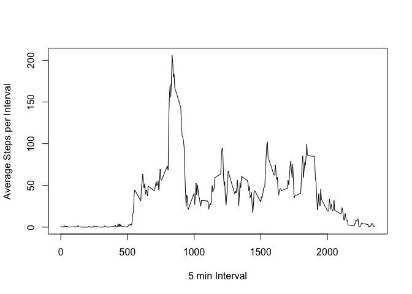
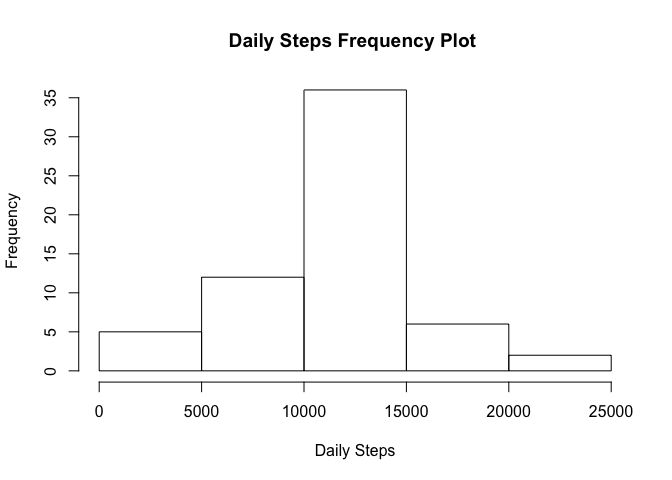
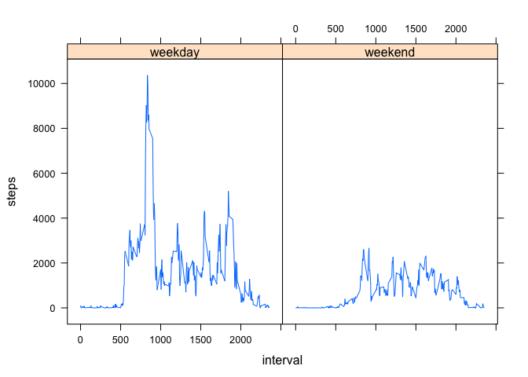

## Loading and preprocessing the data
First load data we load the data from "activity.csv" and store into a Dataframe called "activity":

```r
activity<-read.csv("activity.csv")
```

## What is mean total number of steps taken per day?
In order to plot a histogram of daily steps and calculate the mean & median daily steps, we aggregate the steps by day using the function "aggregate" and apply appropriate column names:

```r
#Sum up steps taken each day using the 'aggregate' function and store it into a dataframe called 'activity_byDay'
activity_byDay<-aggregate(activity$steps,by=list(as.Date(activity$date)),sum)

#Give appropriate coumn names for newly created datafrae
colnames(activity_byDay)<-c("date","dailysteps")
```

From the aggregated data of **activity_byDay** we create a frequency plot (histogram) of daily steps:

```r
hist(activity_byDay$dailysteps, xlab="Daily Steps", main = "Daily Steps Frequency Plot")
```

<!-- -->

We can also look at the *mean* "daily steps" (we remove NA values):

```r
mean(activity_byDay$dailysteps, na.rm = TRUE)
```

```
## [1] 10766.19
```
and the *median* daily steps is:

```r
median(activity_byDay$dailysteps, na.rm = TRUE)
```

```
## [1] 10765
```

## What is the average daily activity pattern?
First we create a new data frame with average steps for each 5-min interval and assgin relevant names:

```r
#Calculate the average steps for each 5-min interval
AvgStepsPerInt<-aggregate(activity$steps,by=list(activity$interval),mean,na.rm=TRUE)

#Give new data frame appropriate names
colnames(AvgStepsPerInt)<-c("interval","averagesteps")
```

Then we plot a time series for the average steps for each interval of the day:

```r
plot(AvgStepsPerInt$interval,AvgStepsPerInt$averagesteps,type='l',xlab="5 min Interval",ylab="Average Steps per Interval")
```

<!-- -->

We can see that the maximum average steps per day happens in the morning at:

```r
AvgStepsPerInt$interval[AvgStepsPerInt$averagesteps==max(AvgStepsPerInt$averagesteps)]
```

```
## [1] 835
```

## Imputing missing values
There are NA values in the loaded data set, which add up to:

```r
sum(is.na(activity$steps))
```

```
## [1] 2304
```

Where there's an "NA" value, we're going to replace it with the average steps of that specific 5-minute interval obtained in the previous section:

```r
#create a clone of loaded csv data
activityNoNA<-activity

#Where there are NAs, then replace the NA value with the average steps for that specific 5-min interval calculated in the previous section and create a new df called 'activityNoNA.

activityNoNA$steps<-ifelse(is.na(activityNoNA$steps), #IF there's an NA value
AvgStepsPerInt$averagesteps[match(activityNoNA$interval,AvgStepsPerInt$interval)], #THEN lookup the average step for that 5-min interval from AvgStepsPerInt df
                           
activityNoNA$steps) #ELSE if there's no NA value use existing value
```

In order to plot a histogram with new data (with no NAs), we sum steps by day:

```r
activityNoNA_daily<-aggregate(activityNoNA$steps,by=list(as.Date(activityNoNA$date)),sum)
colnames(activityNoNA_daily)<-c("date","dailysteps")
```
With the new aggregated data, we plot histogram of Daily Steps:

```r
hist(activityNoNA_daily$dailysteps, xlab="Daily Steps", main = "Daily Steps Frequency Plot ")
```

<!-- -->

the new data has a *mean* of steps:

```r
mean(activityNoNA_daily$dailysteps)
```

```
## [1] 10766.19
```

And a *median* of:

```r
median(activityNoNA_daily$dailysteps)
```

```
## [1] 10766.19
```

By replacing the NA values from the average steps calculated per 5-min interval, we can see the mean didn't change, but the median is now identical to the mean

## Are there differences in activity patterns between weekdays and weekends?
To investigate this question, we'll first figure out whether the date in 'activity' falls on a 'weekday' or 'weekend'

```r
#discern whether it's a weekday or weekend and store into a vector ("DayType")

daytype<-ifelse(weekdays(as.Date(activityNoNA$date))=="Sunday"|weekdays(as.Date(activityNoNA$date))=="Saturday",                             #IF the day is a Saturday OR Sunday
                "weekend",  #THEN store 'weekend'
                "weekday")  #ELSE store 'weekday'

#Merge DayType vector with activityNoNA
activityNoNA_daytype<-data.frame(activityNoNA,daytype)

#Sum steps by DayType and Interval
AvgStepsPerInt_daytype<-aggregate(activityNoNA_daytype$steps,by=list(activityNoNA_daytype$interval,activityNoNA_daytype$daytype),sum)

#Give new table (AvgStepsPerInt_daytype) appropriate column names
colnames(AvgStepsPerInt_daytype)<-c("interval","daytype","steps")

#Plot steps per 5-min interval, split by day type (using Lattice library):
library(lattice)
xyplot(steps~interval| daytype,data=AvgStepsPerInt_daytype, type="l")
```

<!-- -->

It can be noted that the maximum steps on weekends is considerably less than on weekdays. Also the variation of steps throughout the day on weekends is much less than on weekdays.
